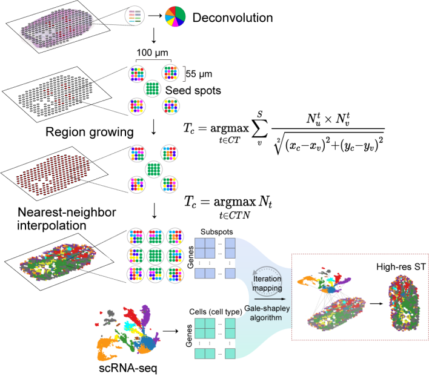

# DRIM
DRIM:Deconvolution followed by Region-growing,Interpolation and iterative-Mapping  
This is an R package  
website url:http://db.regeomics.cn/

## Overview 
&nbsp;  
To achieve single-cell resolution, we developed the single-cell Deconvolution followed by Region-growing, Interpolation and iterative-Mapping (DRIM) algorithm that integrates spatial gene expression with scRNA-seq data from the corresponding time-point to infer single-cell resolution expression maps. DRIM is a R package for increasing the resolution of the spatial transcriptome and mapping single cells.    
&nbsp;  
&nbsp;  
   
&nbsp;  
&nbsp;  
  
  
## Installation
### Setup
DRIM is available from GitHub with:

```
#If you don't have devtools installed, please install it first

install.packages("devtools")

devtools::install_github("zenglab-regeneration/DRIM")

```

### Depend

Some programs of our project require a python environment, so if you don't have a python environment, please follow the steps below.  
* install [anaconda](https://www.anaconda.com/ "anaconda")
* Create a python3.9 environment  

When you have anaconda installed, you need to create a python conda.
```
conda create -n testconda python = 3.9
```

## Examples from paper
### Dataset 
- Single-cell transcriptome gene expression matrix
- Spatial transcriptome gene expression matrix
- Single cell type data
### Environment settings


```
library('DRIM')
help(package = 'DRIM')

#set the py conda
pythonEnvSet("D:/anaconda/envs/testconda")

#Check the dependent environment for the program to run, and automatically install the missing python package
testEnv()
```
### Data processing
**sc_rds**:*Single-cell transcriptome data*  
**st_rds**:Spatial transcriptome data    
**deconvolution_matrix**:Spatial spot deconvolution results 

```
sc_rds<-readRDS("D:/code/data/sct_data_1.5d.rds")
st_rds<-readRDS("D:/code/data/spatial_obj.rds")
deconvolution_matrix = read.csv("D:/code/data/deconvolution.csv", row.names = 1,header = TRUE)
```
**sc_exp_data**：Single-cell transcriptome gene expression matrix  
**st_exp_data**：Spatial transcriptome gene expression matrix  
**sc_celltype_data**：meta.data  
**loc_matrix**：Spatial transcriptome coordinates information  
**deconvolution_matrix**：Spatial spot deconvolution results  
```
dataProcessing(sc_exp_data = sc_rds@assays$SCT@data,  
                st_exp_data = st_rds$timing_0h@assays$Spatial@data,
                sc_celltype_data = sc_rds@meta.data,
                loc_matrix = st_rds$timing_0h@images$slice1@coordinates,
                deconvolution_matrix = deconvolution_matrix)
```
### Printing raw plot of cell type prediced by LableTransfer from Seurat.
 
### Run
**resolution**：magnification  
**colname**：selected data column  
```
result <- drim(resolution = 4,thread = 7,colname="final_celltype")
```
Returns a dataframe object, if you want to return a seurat object, please use get_seurat_result.  

### Drim plot
```
pic <- drimPlot()
```
### Printing processed plot of cell type mapped by drim.
 
### Get a seurat object
**resolution**:magnification  
**sc_rds**:Single-cell transcriptome data
```
obj <- getSeuratObject(sc_rds,resplution = 4)
```
This feature is still being tested, and it is not recommended to use it now
